# Домашнее задание к занятию 5. «Практическое применение Docker». Шелухин Юрий.

### Примечание: Ознакомьтесь со схемой виртуального стенда [по ссылке](https://github.com/netology-code/shvirtd-example-python/blob/main/schema.pdf)

---

## Задача 0
1. Убедитесь что у вас НЕ(!) установлен ```docker-compose```, для этого получите следующую ошибку от команды ```docker-compose --version```
```
Command 'docker-compose' not found, but can be installed with:

sudo snap install docker          # version 24.0.5, or
sudo apt  install docker-compose  # version 1.25.0-1

See 'snap info docker' for additional versions.
```
В случае наличия установленного в системе ```docker-compose``` - удалите его.  
2. Убедитесь что у вас УСТАНОВЛЕН ```docker compose```(без тире) версии не менее v2.24.X, для это выполните команду ```docker compose version```  


**Решение**

1. Удалим docker-compose.  

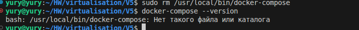 

2. Установим docker compose.   

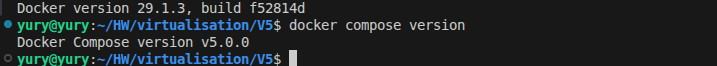 
   
---
 
## Задача 1
1. Сделайте в своем GitHub пространстве fork [репозитория](https://github.com/netology-code/shvirtd-example-python).

2. Создайте файл ```Dockerfile.python``` на основе существующего `Dockerfile`:
   - Используйте базовый образ ```python:3.12-slim```
   - Обязательно используйте конструкцию ```COPY . .``` в Dockerfile
   - Создайте `.dockerignore` файл для исключения ненужных файлов
   - Используйте ```CMD ["uvicorn", "main:app", "--host", "0.0.0.0", "--port", "5000"]``` для запуска
   - Протестируйте корректность сборки 
3. (Необязательная часть, *) Изучите инструкцию в проекте и запустите web-приложение без использования docker, с помощью venv. (Mysql БД можно запустить в docker run).
4. (Необязательная часть, *) Изучите код приложения и добавьте управление названием таблицы через ENV переменную.

---

### ВНИМАНИЕ!
!!! В процессе последующего выполнения ДЗ НЕ изменяйте содержимое файлов в fork-репозитории! Ваша задача ДОБАВИТЬ 5 файлов: ```Dockerfile.python```, ```compose.yaml```, ```.gitignore```, ```.dockerignore```,```bash-скрипт```. Если вам понадобилось внести иные изменения в проект - вы что-то делаете неверно!

**Решение**

1. Сделаем fork репозитория.
   
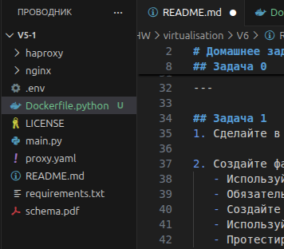 

2. Создадим файл Dockerfile.python.  
```
FROM python:3.9-slim
WORKDIR /app
COPY requirements.txt .
RUN pip install --no-cache-dir --upgrade -r requirements.txt
COPY . .
CMD ["uvicorn", "main:app", "--host", "0.0.0.0", "--port", "5000"]
```
Протестируем корректность сборки.  

`docker build -f Dockerfile.python -t my-fastapi-app .`  

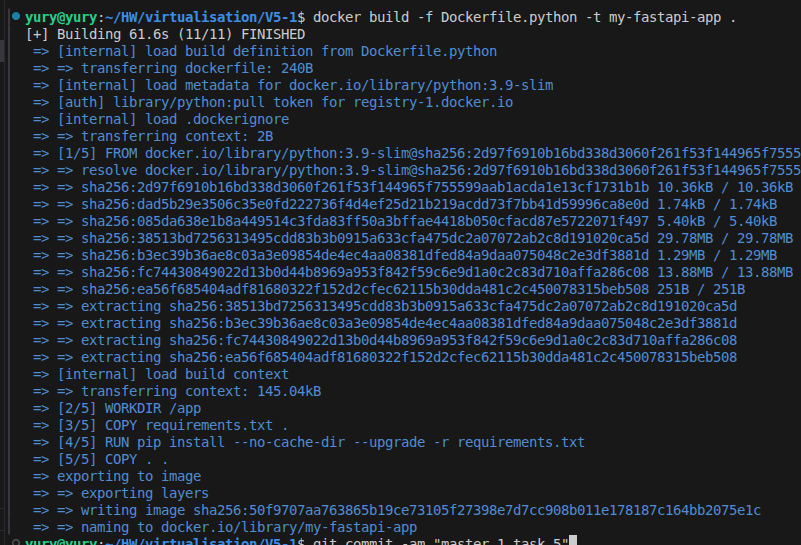 

Запустим контейнер, проверим логи и состояние.  
`docker run -d -p 5000:5000 --name fastapi-test my-fastapi-app`  
`docker logs fastapi-test`  
`docker ps`  

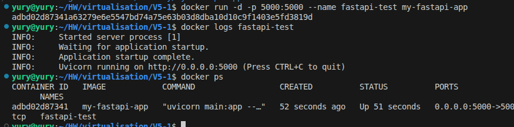 

3. Запустим web-приложение без использования docker, с помощью venv. (Mysql БД в docker run).

Установим в систему venv, установим зависимости.    
`sudo apt install python3-pip`  
`sudo apt install python3-venv`  
`pip install virtualenv --break-system-packages`  

Создадим виртуальное окружение.       
`/home/yury/.local/bin/virtualenv venv` 

Установим зависимости через активированное venv. 
`bash -c "source venv/bin/activate && pip install -r requirements.txt"`  

Запустим mysql в контейнере.

```
docker run -d --name mysql-db -e MYSQL_ROOT_PASSWORD=rootpass -e MYSQL_DATABASE=example -e MYSQL_USER=app \
-e MYSQL_PASSWORD=very_strong -p 3306:3306 mysql:8.0
```
Запустим web-приложение.  

```
bash -c "source venv/bin/activate && \
export DB_HOST='127.0.0.1' && \
export DB_USER='app' && \
export DB_PASSWORD='very_strong' && \
export DB_NAME='example' && \
uvicorn main:app --host 0.0.0.0 --port 5000 --reload"
```
Проверим работу.    
`docker ps`  
`docker logs mysql-db`  

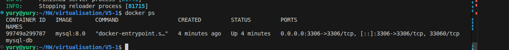 
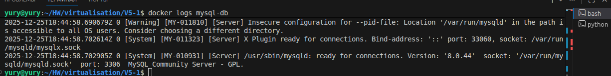 
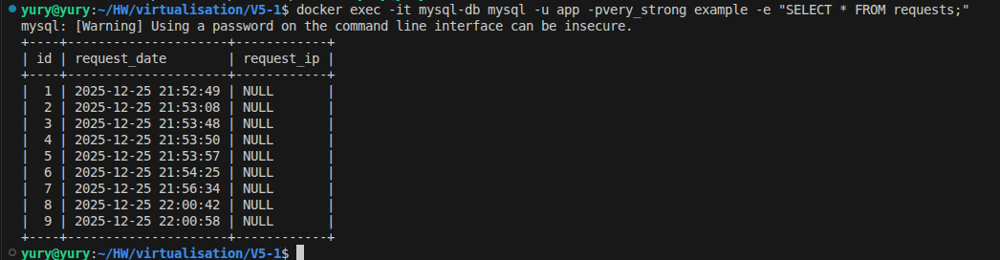 
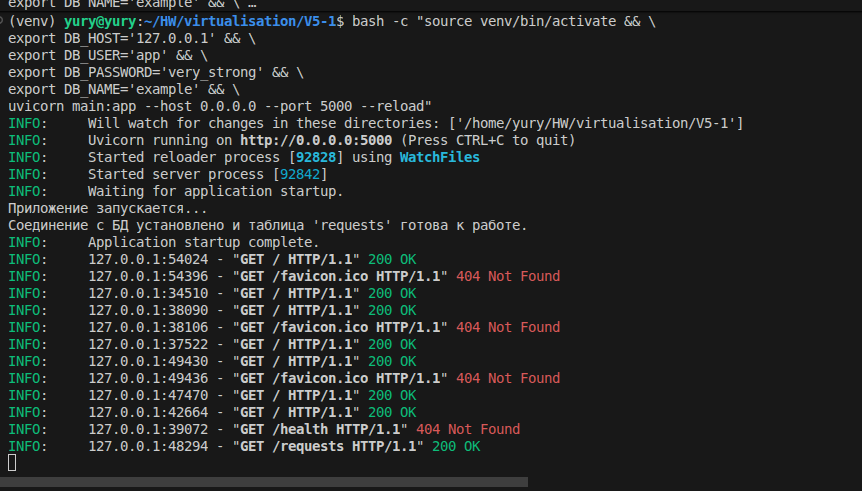 

---


## Задача 2 (*)
1. Создайте в yandex cloud container registry с именем "test" с помощью "yc tool" . [Инструкция](https://cloud.yandex.ru/ru/docs/container-registry/quickstart/?from=int-console-help)
2. Настройте аутентификацию вашего локального docker в yandex container registry.
3. Соберите и залейте в него образ с python приложением из задания №1.
4. Просканируйте образ на уязвимости.
5. В качестве ответа приложите отчет сканирования.

**Решение**


1. Создадим  container registry
`yc container registry create --name test create --name test`

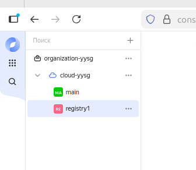 

2. Настроим аутентификацию локального docker.   
`yc container registry configure-docker`

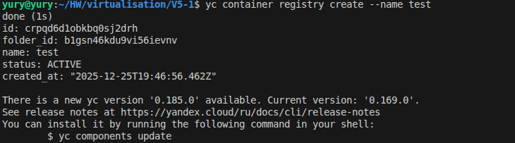 
   
3. Присвоим образу тег.  
`docker tag my-fastapi-app:latest cr.yandex/crpqd6d1obkbq0sj2drh/my-fastapi-app:latest`

4. Зальем образ в репозиторий.  
`docker push cr.yandex/crpqd6d1obkbq0sj2drh/my-fastapi-app:latest`

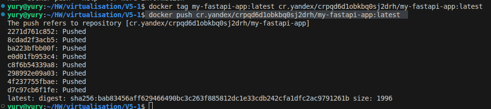
 

5. Изучим результаты сканирования.  

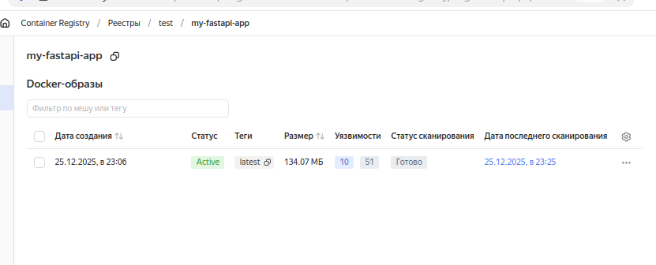
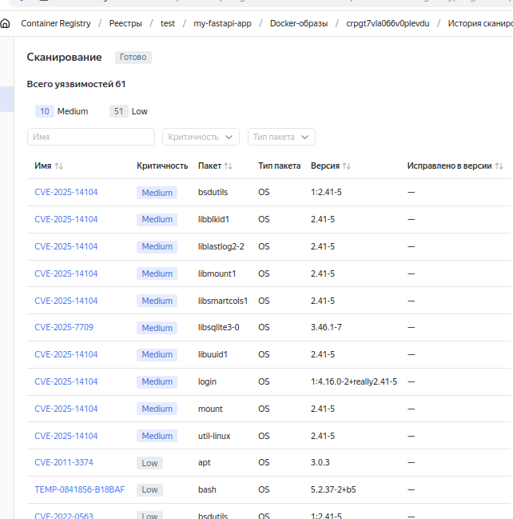

---


## Задача 3
1. Изучите файл "proxy.yaml"
2. Создайте в репозитории с проектом файл ```compose.yaml```. С помощью директивы "include" подключите к нему файл "proxy.yaml".
3. Опишите в файле ```compose.yaml``` следующие сервисы: 

- ```web```. Образ приложения должен ИЛИ собираться при запуске compose из файла ```Dockerfile.python``` ИЛИ скачиваться из yandex cloud container registry(из задание №2 со *). Контейнер должен работать в bridge-сети с названием ```backend``` и иметь фиксированный ipv4-адрес ```172.20.0.5```. Сервис должен всегда перезапускаться в случае ошибок.
Передайте необходимые ENV-переменные для подключения к Mysql базе данных по сетевому имени сервиса ```web``` 

- ```db```. image=mysql:8. Контейнер должен работать в bridge-сети с названием ```backend``` и иметь фиксированный ipv4-адрес ```172.20.0.10```. Явно перезапуск сервиса в случае ошибок. Передайте необходимые ENV-переменные для создания: пароля root пользователя, создания базы данных, пользователя и пароля для web-приложения.Обязательно используйте уже существующий .env file для назначения секретных ENV-переменных!

4. Запустите проект локально с помощью docker compose , добейтесь его стабильной работы: команда ```curl -L http://127.0.0.1:8090``` должна возвращать в качестве ответа время и локальный IP-адрес. Если сервисы не стартуют воспользуйтесь командами: ```docker ps -a ``` и ```docker logs <container_name>``` . Если вместо IP-адреса вы получаете информационную ошибку --убедитесь, что вы шлете запрос на порт ```8090```, а не 5000.

5. Подключитесь к БД mysql с помощью команды ```docker exec -ti <имя_контейнера> mysql -uroot -p<пароль root-пользователя>```(обратите внимание что между ключем -u и логином root нет пробела. это важно!!! тоже самое с паролем) . Введите последовательно команды (не забываем в конце символ ; ): ```show databases; use <имя вашей базы данных(по-умолчанию example)>; show tables; SELECT * from requests LIMIT 10;```.

6. Остановите проект. В качестве ответа приложите скриншот sql-запроса.

**Решение**

1. Файл proxy.yaml определяет два сервиса (контейнера), которые работают вместе как прокси-слой:
- reverse-proxy (HAProxy) — балансировщик нагрузки/обратный прокси внутри Docker-сети.
- ingress-proxy (nginx) — внешний шлюз, входной (ingress) прокси, принимающий запросы снаружи (с хоста).
- Сеть backend. Изолированная внутренняя сеть, в которой находятся reverse-proxy, web и db. К ней подключен и ingress-proxy (хоть он и в режиме host), чтобы "видеть" другие сервисы по их именам (например, web).

2-3. Создадим файл compose.yaml.  
4. Запустим проект.  
`docker compose up -d`   

 
   
Проверим работу приложения через curl.   
`curl -L http://127.0.0.1:8090`

 

5. Подключиvcz к БД mysql.  
```
docker exec -ti mysql-db mysql -uroot -pYtReWq4321 -e "
show databases;
use virtd;
show tables;
SELECT * FROM requests LIMIT 10;"
```
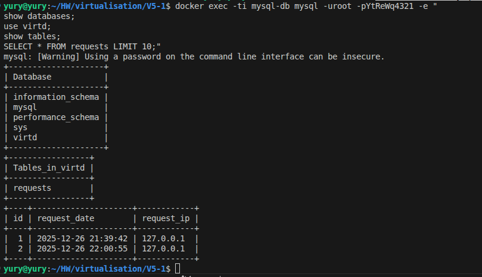 

---


## Задача 4
1. Запустите в Yandex Cloud ВМ (вам хватит 2 Гб Ram).
2. Подключитесь к Вм по ssh и установите docker.
3. Напишите bash-скрипт, который скачает ваш fork-репозиторий в каталог /opt и запустит проект целиком.
4. Зайдите на сайт проверки http подключений, например(или аналогичный): ```https://check-host.net/check-http``` и запустите проверку вашего сервиса ```http://<внешний_IP-адрес_вашей_ВМ>:8090```. Таким образом трафик будет направлен в ingress-proxy. Трафик должен пройти через цепочки: Пользователь → Internet → Nginx → HAProxy → FastAPI(запись в БД) → HAProxy → Nginx → Internet → Пользователь
5. (Необязательная часть) Дополнительно настройте remote ssh context к вашему серверу. Отобразите список контекстов и результат удаленного выполнения ```docker ps -a```
6. Повторите SQL-запрос на сервере и приложите скриншот и ссылку на fork.

**Решение**

1. Запустим в Yandex Cloud ВМ.

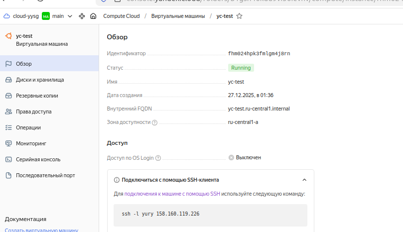 

2. Подключимся к Вм по ssh и установим docker.   
`ssh -i /home/yury/HW/terraform/04/secrets/yandex-cloud-key yury@158.160.119.226`

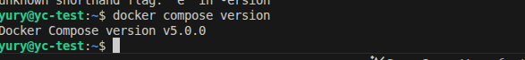

1. Напишем bash-скрип и разместим файл `deploy.sh` в директории `/opt`.   
```
#!/bin/bash
set -e  # Выход при ошибке

REPO_URL="https://github.com/YuryShelukhin/virt6.git"
PROJECT_DIR="/opt/project"

# 1. Клонируем репозиторий
echo "Клонируем репозиторий..."
sudo rm -rf "$PROJECT_DIR"
sudo git clone "$REPO_URL" "$PROJECT_DIR"
cd "$PROJECT_DIR"

# 2. Запускаем проект
echo "Запускаем Docker Compose..."
sudo docker compose down 2>/dev/null || true
sudo docker compose up -d --build

echo "Готово! Проект запущен."
```

Создадим директорию /opt/project. Запустим скрипт.  
`sudo sh deploy.sh`

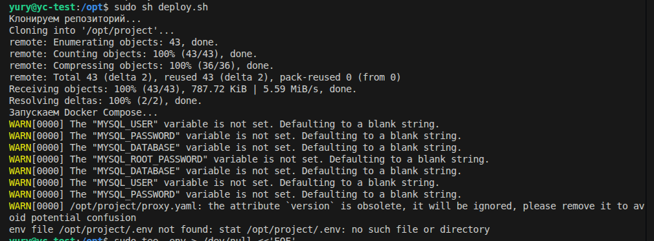 

После отработки скрипта и клонирования репозитория, зайдем в директрию `project` и остановим docker compose. Затем создадим в этой директории файл с секретами и поменяем у него права.
```
sudo tee .env > /dev/null <<'EOF'
MYSQL_ROOT_PASSWORD="YtReWq4321"
MYSQL_DATABASE="virtd"
MYSQL_USER="app"
MYSQL_PASSWORD="QwErTy1234"
EOF
```
`sudo chmod 600 .env`

Перезапустим ВМ и вновь запустим docker compose.

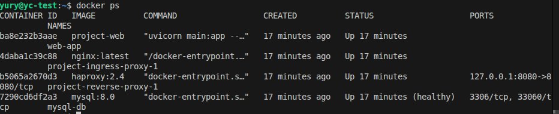 

Проверим доступ к сервису с хоста.


Проверим http подключение.

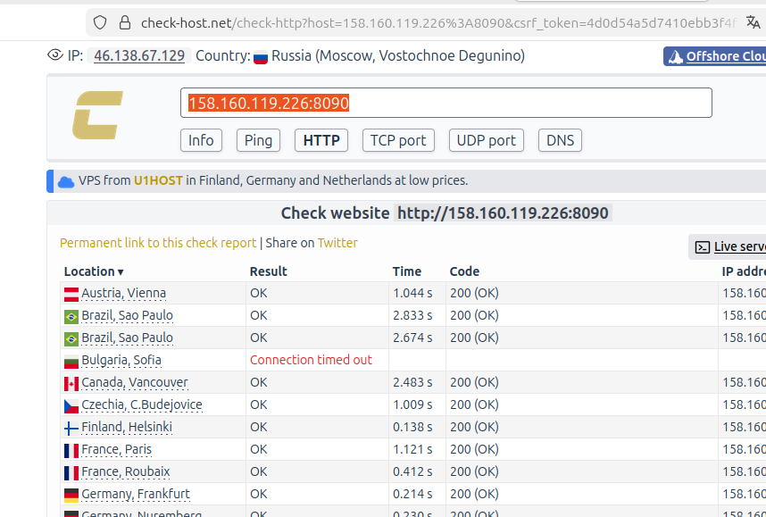 

Проверим данные БД.

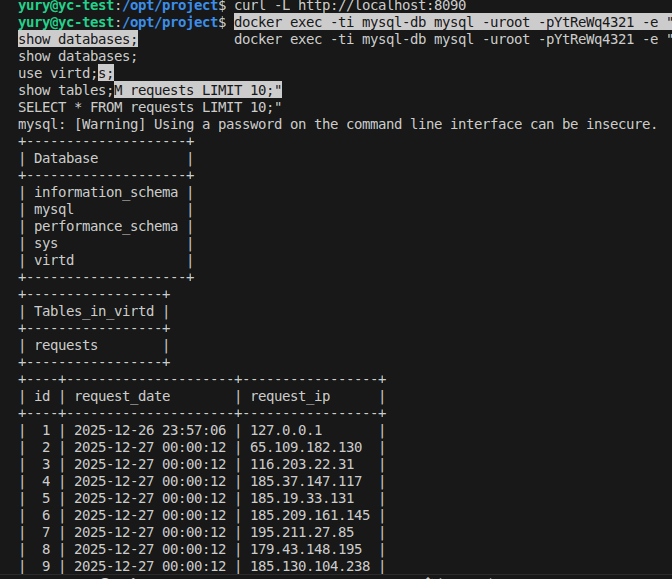 

---


## Задача 5 (*)
1. Напишите и задеплойте на вашу облачную ВМ bash скрипт, который произведет резервное копирование БД mysql в директорию "/opt/backup" с помощью запуска в сети "backend" контейнера из образа ```schnitzler/mysqldump``` при помощи ```docker run ...``` команды. Подсказка: "документация образа."
2. Протестируйте ручной запуск
3. Настройте выполнение скрипта раз в 1 минуту через cron, crontab или systemctl timer. Придумайте способ не светить логин/пароль в git!!
4. Предоставьте скрипт, cron-task и скриншот с несколькими резервными копиями в "/opt/backup"

**Решение**

1. Зайдем на ВМ и создадим директорию для бекапа.  IP поменялся после прерывания ВМ.  
`ssh -i /home/yury/HW/terraform/04/secrets/yandex-cloud-key yury@89.169.129.114`  
`mkdir /opt/backup`

Напишем bash-скрип mysql_backup.sh и разместим в директории /opt/backup.   
`sudo vim mysql_backup.sh`
```
#!/bin/bash

BACKUP_DIR="/opt/backup"
mkdir -p "$BACKUP_DIR"
BACKUP_FILE="${BACKUP_DIR}/backup_$(date +%H%M).sql"

docker exec mysql-db mysqldump -u root -pYtReWq4321 virtd > "$BACKUP_FILE"

if [ -s "$BACKUP_FILE" ]; then
    echo "Бэкап создан: $BACKUP_FILE"
    echo "   Размер: $(du -h "$BACKUP_FILE" | cut -f1)"
    chown yury:yury "$BACKUP_FILE"
else
    echo "Ошибка при создании бэкапа"
    exit 1
fi
```
Сделаем права на выполнение скрипта.    
`sudo chmod +x mysql_backup.sh`  

Назначим права на запись в директорию.  
`sudo chmod 777 /opt/backup`  

Выполним скрипт вручную.  
`./mysql_backup.sh`  

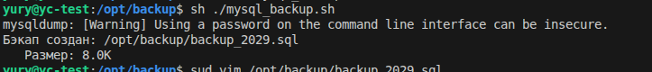

Настраиваем crontab.  
`crontab -e`

Добавим текст.
```
# MySQL backup every minute
* * * * * /opt/backup/mysql_backup.sh
```

Проверим результат.

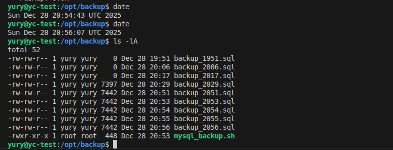

---


## Задача 6
Скачайте docker образ ```hashicorp/terraform:latest``` и скопируйте бинарный файл ```/bin/terraform``` на свою локальную машину, используя dive и docker save.
Предоставьте скриншоты  действий .

**Решение**

Скачаем образ.   
`docker pull hashicorp/terraform:latest`

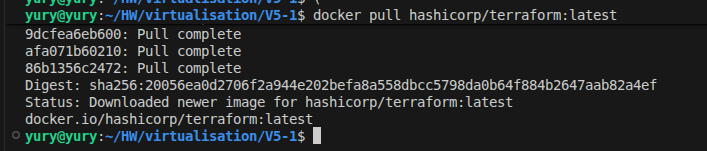 

Установим Dive.   
`snap install dive`

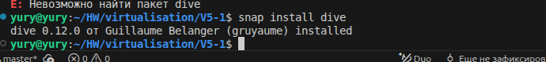 

Так как dive установлен через snap, настроим его подключение к docker.    
`sudo snap connect dive:docker-executables docker:docker-executables`    
`sudo snap connect dive:docker-daemon docker:docker-daemon`  

Исследуем образ.    
`dive hashicorp/terraform:lates`    

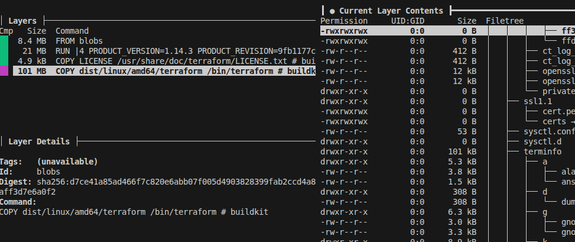  

Сохраняем образ в tar-архив.  
`docker save hashicorp/terraform:latest -o terraform-image.tar`  

Распаковываем архив.  
`mkdir terraform-extract`  
`cd terraform-extract`  
`tar -xf ../terraform-image.tar`  

После распаковки ищем (долго) слой, содержащий /bin/  terraform.  

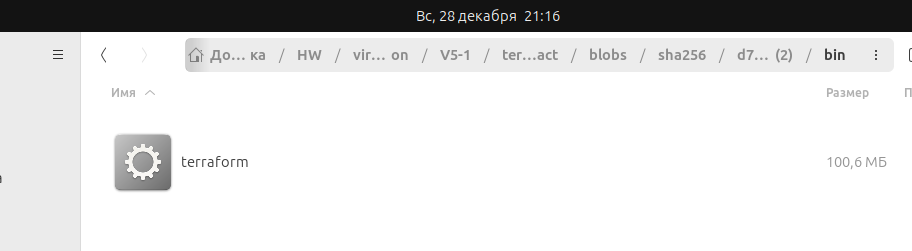  

---


## Задача 6.1
Добейтесь аналогичного результата, используя docker cp.  
Предоставьте скриншоты  действий .

**Решение**

Создаем временный контейнер из образа.  
`docker create --name temp-terraform hashicorp/terraform:latest`  

Копируем файл /bin/terraform на локальную машину.  
`docker cp temp-terraform:/bin/terraform ./terraform`  

Удаляем временный контейнер.  
`docker rm temp-terraform`  

Проверяем, что файл скопировался.  
`ls -la ./terraform`  
`file ./terraform`  

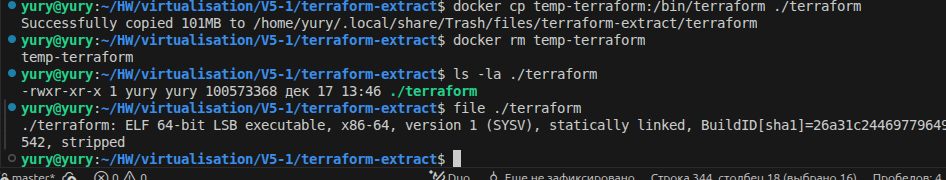  

---

## Задача 6.2 (**)

Предложите способ извлечь файл из контейнера, используя только команду docker build и любой Dockerfile.  
Предоставьте скриншоты  действий .

**Решение**

Создадим файл Dockerfile.extract в корне проекта. Собираем образ.  
`docker build -t terraform-extracted -f Dockerfile.extract .`  

Создаем временный контейнер и копируем файл.  
`docker create --name temp-extract --entrypoint /bin/sh terraform-extracted`  
`docker cp temp-extract:/terraform ./terraform-extracted`  
`docker rm temp-extract`  

Проверяем.  
`ls -la ./terraform-from-build`  


---

## Задача 7 (***)
Запустите ваше python-приложение с помощью runC, не используя docker или containerd.  
Предоставьте скриншоты  действий .

---

